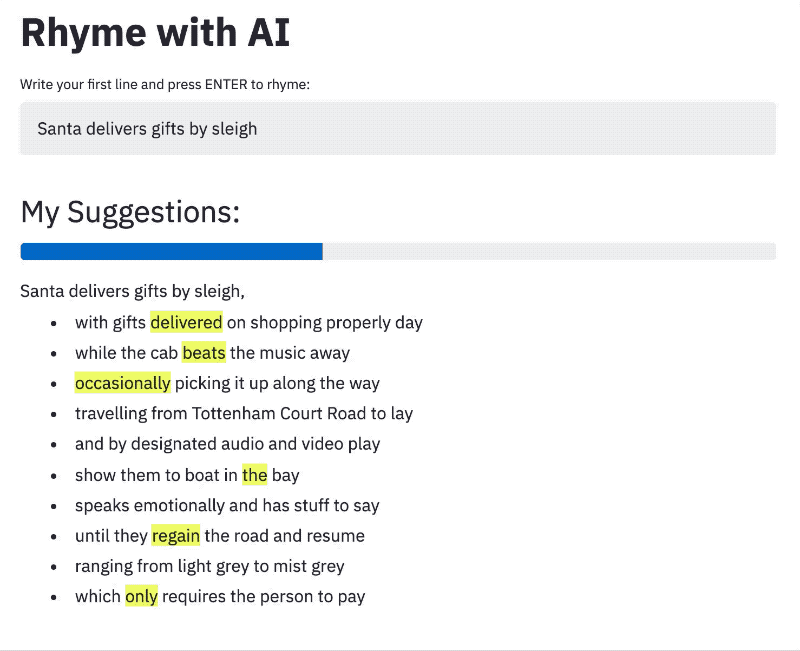

## Local development

Create a [conda](https://docs.conda.io/projects/conda/en/latest/user-guide/install/) virtual environment and activate it:

```bash
conda env create --file environment.yml
conda activate rhyme-with-ai
```

Install the `rhyme_with_ai` package and all its dependencies:

```bash
pip install --editable .
```

Download the weights of the models (if you get any errors, make sure these align with those specified in `app/app.py`)):

```bash
make download-data
```

Run the app:

```bash
make streamlit
```

Test the Docker containers by running:

```bash
make docker-build
make docker-serve
```

This project uses [black](https://github.com/ambv/black) for code formatting.
To incorporate it in your version control follow the instructions below (copied from black's own readme):

---

Use [pre-commit](https://pre-commit.com/). Once you [have it installed](https://pre-commit.com/#install), add this to the `.pre-commit-config.yaml` in your repository:

```yaml
repos:
-   repo: https://github.com/ambv/black
    rev: stable
    hooks:
    - id: black
      language_version: python3.7
```

Then run `pre-commit install` and you're ready to go.


## Deploy to App Engine

Follow Google's documentation to set up [Custom Runtimes in the App Engine Flexible Environment](https://cloud.google.com/appengine/docs/flexible/custom-runtimes/quickstart).
Deploy the app:

```bash
gcloud app deploy
```

And you're done!


## Todo

* Integrate TokenWeighter in the RhymeGenerator.
* Don't block on model loading or rhyme mutations (use API?).
